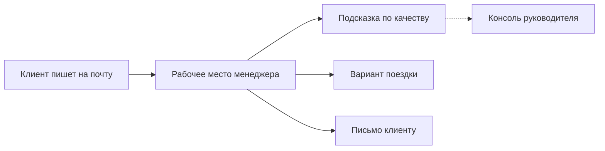

# AI Помощник в коммуникации с клиентами

Сервис имитирует рабочее место менеджера, который оформляет командировки сотрудникам клиентских компаний. Клиент пишет сотруднику на обычную почту — сотрудник ведет переписку внутри сервиса и имеет дополнительный функционал в виде подсказок по тону ответа и подбора вариантов «перелёт + отель» исходя из условий клиента.  
Человек всегда сам решает, что отправить.

Это **пилот для демонстрации**: живой стенд, на котором видно, как такой сервис может работать по реальным сценариям.

Стенд: [https://assistant.gyhyry.com](https://assistant.gyhyry.com)

## Что готово на этапе пилота

- **Удобный UI вместо почтового ящика.** Все переписки с клиентами в одном месте. Ответ сотрудника уходит обычным письмом.
- **Анализ качества ответа.** Если формулировка слишком разговорная или с ошибками, сотрудник видит служебную подсказку. Клиенту она не приходит.
- **Подбор поездки по заявке.** По кнопке сервис собирает вариант из справочника: рейсы туда и обратно, отель, ориентир по стоимости. Если клиент позже меняет даты, города или число людей, новый подбор опирается на последние условия — а не на первое письмо.

Переписка не передаётся сторонним облачным моделям: ИИ работает локально на сервере. На внешнюю почту сервис ходит только затем, чтобы принять письмо клиента и отправить ответ менеджера.

## Как это выглядит

Клиент всегда получает только то, что отправил человек. Подсказки и подобранный пакет остаются внутри сервиса, пока менеджер сам не перенесёт формулировку в письмо.

## Пользователи

Вход без пароля: откройте стенд и выберите сотрудника в списке.

| Сотрудник     | Роль         | Куда писать с внешней почты                                                     |
| ------------- | ------------ | ------------------------------------------------------------------------------- |
| Анна Соколова | Менеджер     | [communicationassistant36@gmail.com](mailto:communicationassistant36@gmail.com) |
| Дмитрий Орлов | Менеджер     | [communicationassistant52@gmail.com](mailto:communicationassistant52@gmail.com) |
| Елена Волкова | Менеджер     | [communicationassistant65@gmail.com](mailto:communicationassistant65@gmail.com) |
| Игорь Белов   | Руководитель | нет почты — только консоль и переписки сотрудников                              |

У каждого менеджера своя лента. Руководитель клиентам не пишет: смотрит цифры по отделу и при необходимости открывает любую переписку.

Цены и наличие мест в пилоте **учебные**. Это не реальные предложения перевозчиков.

## Сценарии

Ниже — три коротких прохода. Их достаточно, чтобы увидеть и пользу, и границу пилотной версии.

### 1. Рабочий день менеджера

1. Откройте [стенд](https://assistant.gyhyry.com) и войдите как **Анна Соколова**.
2. С любой своей почты напишите на `communicationassistant36@gmail.com` заявку, например: «Нужно оформить командировку двум сотрудникам из Москвы в Санкт-Петербург с 1 по 5 сентября».
3. Через короткое время письмо появится в ленте Анны. Откройте диалог.
4. Ответьте нарочно небрежно: «ок ща гляну камандировку!!!». В ленте появится жёлтая подсказка для сотрудника. Покажите, что у клиента в ящике её нет.
5. Напишите нормальный деловой ответ — коротко, по существу, без сленга. Подсказки не будет или она будет мягкой.
6. Нажмите **Подобрать решение**. В ленте появится служебная карточка: рейсы, отель, сумма, короткое пояснение выбора.
7. С внешней почты пришлите уточнение: другие даты, другой город или другое число людей. Снова нажмите **Подобрать решение**. Новая карточка следует за последними условиями, а не за первым письмом. То, что клиент не менял, остаётся в силе.
8. Вставьте формулировку в ответ и отправьте. Клиент получает только текст менеджера, не карточку ИИ.

Смысл: сервис не отвечает за человека. Он ускоряет работу и дает подсказки, а решение об отправке остаётся у менеджера.

### 2. Взгляд руководителя

1. Выйдите из профиля Анны и войдите как **Игорь Белов**.
2. На консоли — цифры по отделу и по каждому менеджеру: как отвечают, где проседает стиль, как меняется оценка.
3. Откройте переписку Анны из предыдущего сценария. Руководитель видит те же служебные карточки, что и менеджер.

Смысл: качество переписки видно не только в момент ответа, но и как цельная картина по отделу — без чтения каждого письма вручную.

### 3. Где пилот останавливается

1. Снова войдите как **Анна Соколова** (или другой менеджер).
2. С внешней почты пришлите заявку **в Томск** (или другой город, которого нет в учебном справочнике).
3. Нажмите **Подобрать решение**. Сервис не выдумает рейсы: вежливо откажет, потому что направления нет в справочнике.

Дополнительно можно прислать заявку **без дат**. Система попросит уточнить, а не подставит даты «от себя».

Смысл: пилот не притворяется, что умеет бронировать то, чего нет. Лучше честный отказ, чем красивая ошибка.

## Что уже есть и куда расти

| Сейчас, на пилоте                                                       | Дальше, если идти в продукт                                                  |
| ----------------------------------------------------------------------- | ---------------------------------------------------------------------------- |
| Живая почта: письмо клиента приходит в ленту, ответ уходит в его ящик   | Подключение настоящих рейсов и отелей, бронирование, а не учебный справочник |
| Оценка исходящих ответов и подсказки сотрудникам                        | Черновик ответа в стиле компании — по-прежнему без автоотправки клиенту      |
| Подбор из демо-справочника по последним условиям клиента (даты, города) | Больше городов, больше сотрудников, привычные вложения к письмам             |
| Консоль руководителя по качеству переписки                              | Регламенты и сроки ответа, сводка не только по стилю, но и по скорости       |

Принцип, который стоит сохранить и после пилота: **клиенту не уходит ничего, что не подтвердил человек**.

Запуск на новом сервере — [LAUNCH.md](LAUNCH.md). Устройство стенда — [ARCHITECTURE.md](ARCHITECTURE.md).
