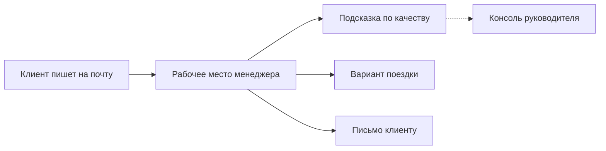

# Помощник в коммуникации с клиентами

Рабочее место менеджера, который оформляет командировки сотрудникам клиентских компаний. Клиент пишет на обычную почту — переписка, подсказки по тону ответа и вариант «перелёт + отель» собираются в одном окне. Человек всегда сам решает, что отправить.

Это **пилот для демонстрации**: живой стенд, на котором видно, как такой сервис работает на настоящей почте. Это ещё не коммерческий продукт.

Стенд: [https://assistant.gyhyry.com](https://assistant.gyhyry.com)

## Зачем это на этапе пилота

- **Одна картина вместо почтового ящика.** Вся переписка с клиентом в одном месте. Ответ уходит обычным письмом — клиент видит привычный ящик, а не «чат с роботом».
- **Качество ответа без риска для клиента.** Если формулировка слишком разговорная или с ошибками, сотрудник видит служебную подсказку. Клиенту она не приходит.
- **Подбор поездки по заявке.** По кнопке сервис собирает вариант из справочника: рейсы туда и обратно, отель, ориентир по стоимости. Менеджер правит текст и отправляет сам.

Переписка не передаётся сторонним облачным моделям: ИИ работает на нашем сервере. На внешнюю почту сервис ходит только затем, чтобы принять письмо клиента и отправить ответ менеджера.

## Как это выглядит

Клиент всегда получает только то, что отправил человек. Подсказки и подобранный пакет остаются внутри сервиса, пока менеджер сам не перенесёт формулировку в письмо.

## Кто есть на стенде

Вход без пароля: откройте стенд и выберите сотрудника в списке.

| Сотрудник | Роль | Куда писать с внешней почты |
| --- | --- | --- |
| Анна Соколова | Менеджер | communicationassistant36@gmail.com |
| Дмитрий Орлов | Менеджер | communicationassistant52@gmail.com |
| Елена Волкова | Менеджер | communicationassistant65@gmail.com |
| Игорь Белов | Руководитель | нет почты — только консоль и чужие переписки |

У каждого менеджера своя лента. Руководитель клиентам не пишет: смотрит цифры по отделу и при необходимости открывает любую переписку.

Цены и наличие мест в пилоте **учебные**. Это не предложение перевозчика и не бронь.

## Сценарии показа

Ниже — три коротких прохода. Их достаточно, чтобы увидеть и пользу, и честную границу пилота.

### 1. Рабочий день менеджера

1. Откройте [стенд](https://assistant.gyhyry.com) и войдите как **Анна Соколова**.
2. С любой своей почты напишите на `communicationassistant36@gmail.com` заявку, например: «Нужно оформить командировку двум сотрудникам из Москвы в Санкт-Петербург с 1 по 5 сентября».
3. Через короткое время письмо появится в ленте Анны. Откройте диалог.
4. Ответьте нарочно небрежно: «ок ща гляну камандировку!!!». В ленте появится жёлтая подсказка для сотрудника. Покажите, что у клиента в ящике её нет.
5. Напишите нормальный деловой ответ — коротко, по существу, без сленга. Подсказки не будет или она будет мягкой.
6. Нажмите **Подобрать решение**. В ленте появится служебная карточка: рейсы, отель, сумма, короткое пояснение выбора.
7. Вставьте формулировку в ответ и отправьте. Клиент получает только текст менеджера, не карточку ИИ.

Смысл показа: сервис не отвечает за человека. Он ускоряет работу и страхует тон, а решение об отправке остаётся у менеджера.

### 2. Взгляд руководителя

1. Выйдите из профиля Анны и войдите как **Игорь Белов**.
2. На консоли — цифры по отделу и по каждому менеджеру: как отвечают, где проседает стиль, как меняется оценка.
3. Откройте переписку Анны из предыдущего сценария. Руководитель видит те же служебные карточки, что и менеджер.

Смысл показа: качество переписки видно не только в момент ответа, но и как картина по отделу — без чтения каждого письма вручную.

### 3. Где пилот честно останавливается

1. Снова войдите как **Анна Соколова** (или другой менеджер).
2. С внешней почты пришлите заявку **в Томск** (или другой город, которого нет в учебном справочнике).
3. Нажмите **Подобрать решение**. Сервис не выдумает рейсы: вежливо откажет, потому что направления нет в справочнике.

Дополнительно можно прислать заявку **без дат**. Система попросит уточнить, а не подставит даты «от себя».

Смысл показа: пилот не притворяется, что умеет бронировать всю страну. Лучше честный отказ, чем красивая ошибка клиенту.

## Что уже есть и куда расти

| Сейчас, на пилоте | Дальше, если идти в продукт |
| --- | --- |
| Живая почта: письмо клиента приходит в ленту, ответ уходит в его ящик | Подключение настоящих рейсов и отелей, бронирование, а не учебный справочник |
| Оценка исходящих ответов и подсказка только сотруднику | Черновик ответа в стиле компании — по-прежнему без автоотправки клиенту |
| Подбор «перелёт + отель» по крупным городам из демо-справочника | Больше городов, больше сотрудников, привычные вложения к письмам |
| Консоль руководителя по качеству переписки | Регламенты и сроки ответа, сводка не только по стилю, но и по скорости |

Принцип, который стоит сохранить и после пилота: **клиенту не уходит ничего, что не подтвердил человек**.

Устройство стенда и запуск — в [ARCHITECTURE.md](ARCHITECTURE.md), для команды разработки.
